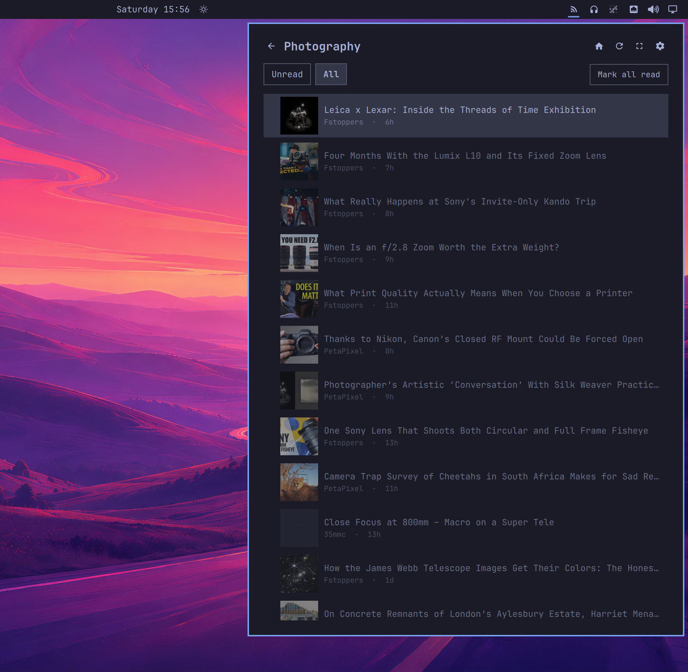
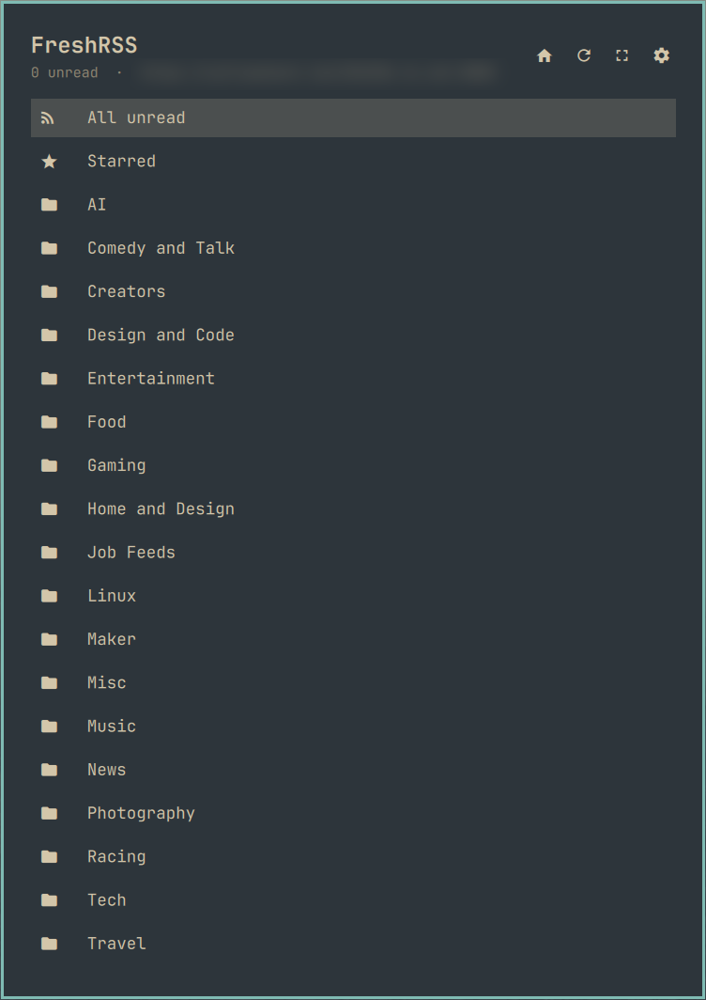
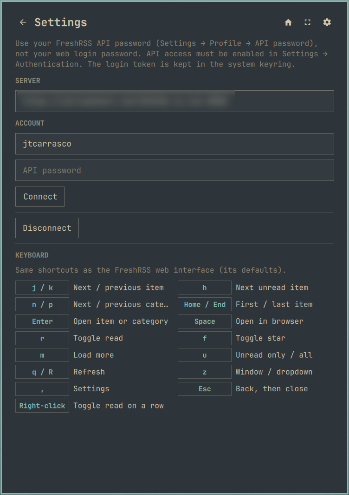
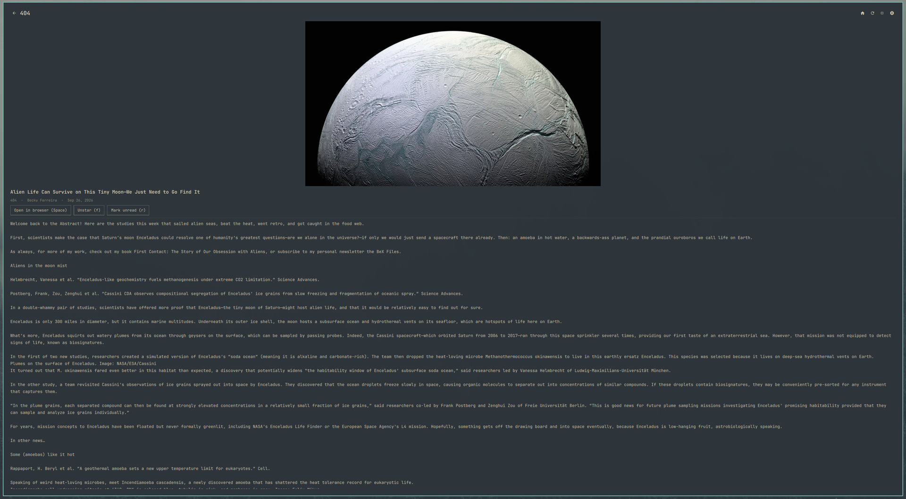

# FreshRSS for Omarchy

A [FreshRSS](https://freshrss.org/) client that lives in the Omarchy bar. The icon
shows your unread count; click it for your categories and articles in a themed
dropdown. Reading, starring and marking items read syncs both ways with your
self-hosted FreshRSS server, so the web app, your phone and the bar agree.

It's keyboard-driven, and the keys are the ones FreshRSS itself uses.

*An independent client. Not affiliated with or endorsed by the FreshRSS project.*



| Categories | Keyboard reference |
|---|---|
|  |  |

Pop out into its own window (`z`):



## Features

- Unread count on the bar icon, updated in the background every 5 minutes
- All unread, Starred, and every category with its unread count
- Article list with thumbnails (the feed's image, or the first image in the
  article), falling back to the feed's favicon
- Article view with the lead image, author, date and a plain-text summary
- Mark read / unread, star / unstar, open in the browser (opening marks it read)
- Mark a whole category or all unread as read (click again to confirm)
- Unread / All toggle and load more
- Pop out into its own resizable window
- A DankMaterialShell version in [`dms/`](dms/) with the same features and keys

## Requirements

- A FreshRSS server (tested with 1.30) with **API access enabled**
  (Settings → Authentication → Allow API access) and an **API password** set
  for your user (Settings → Profile → API management). The plugin uses the API
  password, not your web login password.
- `python3`, `secret-tool` and a running keyring that provides the Secret
  Service, such as gnome-keyring (all ship with Omarchy; minimal installs may
  need `gnome-keyring`).

## Install

```
omarchy plugin add https://github.com/jtcarrasco/freshrss-reader --enable
```

If the RSS icon doesn't appear, add **FreshRSS** to your bar in the shell's bar
settings.

## Setup

1. Click the RSS icon. The first time, the dropdown shows a connect form.
2. Enter your server URL (e.g. `https://rss.example.com`), your FreshRSS
   username and your **API password**.
3. The plugin checks that the address really is a FreshRSS server with the API
   enabled, logs in, and shows your categories.

The API password is only sent to your server to get a login token. The token is
stored in the system keyring (`secret-tool`); only the server URL and username
are written to `~/.config/freshrss-plugin/config.json`.

To switch servers or accounts, open settings (gear, or `,`) and connect again.
**Disconnect** (click twice) removes the saved token and settings from this
computer; nothing changes on the server.

## Usage

**Bar icon**
- Left-click: open or close the dropdown
- Middle-click: refresh

**In the dropdown**
- Click a category to list its items, click an item to read it
- Right-click an item to toggle read / unread
- Header: back, home, refresh, pop out to a window, settings

**Keyboard** (while the dropdown or its window is open)

Every action has a key. The article keys follow FreshRSS's own default
shortcuts, and the same list is shown at the bottom of the settings page.

| Key | Action |
|---|---|
| `j` / `k`, ↓ / ↑ | Next / previous item (or category on the home list) |
| `h` | Next unread item |
| `n` / `p` | Next / previous category |
| Home / End | First / last item |
| Enter | Open the selected item or category |
| Space | Open the item in your browser |
| `r` | Toggle read |
| `f` | Toggle star |
| `m` | Load more |
| `u` | Switch between unread only and all items (FreshRSS's filter key) |
| `q` / `R` | Refresh (`q` is FreshRSS's key, `R` the vim-style one) |
| `z` | Switch between the dropdown and its own window |
| `,` | Settings |
| Esc | Back, then back to the dropdown, then close |

FreshRSS lets you change its shortcuts per user, but the API doesn't expose
them, so the plugin always uses FreshRSS's defaults.

The dropdown can also be driven over IPC, e.g. from a Hyprland keybinding:

```
omarchy-shell freshrss-reader toggle
omarchy-shell freshrss-reader refresh
omarchy-shell freshrss-reader openUnread     # straight to the unread list
omarchy-shell freshrss-reader openSettings
omarchy-shell freshrss-reader popOut         # open in its own window
```

## DankMaterialShell

The [`dms/`](dms/) folder is a standalone DMS plugin with the same features and
keys (except `z`, since DMS popouts have no separate window). Copy the folder
into `~/.config/DankMaterialShell/plugins/FreshRSS`, then enable **FreshRSS** in
DMS settings → Plugins and add it to your bar. Right-clicking the bar icon
refreshes; `dms ipc call freshrssReader toggle | refresh | openUnread` works
from keybindings.

## Uninstall

```
omarchy plugin remove freshrss-reader
```

The login token and local config aren't removed automatically:

```
secret-tool clear service freshrss-plugin account token
rm -rf ~/.config/freshrss-plugin ~/.local/state/freshrss-plugin
```

## Troubleshooting

- **"doesn't look like a FreshRSS server"**: the address answered, but not as
  FreshRSS. Check the URL and port (FreshRSS behind a reverse proxy is often on
  its own port or path).
- **"API isn't enabled"**: turn on Settings → Authentication → Allow API
  access in FreshRSS.
- **"not authorized"**: use the API password from Settings → Profile, not your
  web login password.
- **A category shows unread items but opens empty**: FreshRSS can store a
  category name containing `&` in a form its own API can't look up (common
  after an OPML import). Open the category in FreshRSS's subscription
  management and save it again, or rename it without the `&`. Other API
  clients hit the same problem.
- **Feed icons missing**: the plugin rebuilds FreshRSS's favicon links on the
  address you connected with, which fixes a `base_url` missing its port. If
  icons still don't show, check FreshRSS's `base_url` setting.
- **"no system keyring"**: the plugin stores its token with `secret-tool`,
  which needs a running Secret Service such as gnome-keyring.

## Known limitations

- **Search isn't there yet.** `a` (FreshRSS's search key) shows a note for now.
- **Summaries are plain text.** The article view shows the feed's summary
  without formatting; Space opens the full article in your browser.
- **No subscription management.** Adding feeds, editing categories and OPML
  stay in the FreshRSS web app.
- **Thumbnails load straight from the publishers' sites**, as a browser would.
  AVIF images are skipped (Qt can't decode them without an extra plugin).

## How it works

- `BarWidget.qml`: the bar icon and unread count; hosts the dropdown.
- `Panel.qml`: the dropdown UI, built on the shell's `qs.Ui` components and
  `qs.Commons` theme.
- `scripts/freshrss_backend.py`: every FreshRSS call, through the Google
  Reader-compatible API (`/api/greader.php`), standard library only.
- `dms/`: the DankMaterialShell version. `tools/sync-dms.sh` copies the shared
  `Model.js` and backend into it.

## Development

```
uv run --with pytest python -m pytest tests
```

The tests cover the backend with no network access, and fail if the copies in
`dms/` drift from the shared files (run `tools/sync-dms.sh` after changing them).

## License

MIT, see [LICENSE](LICENSE).
